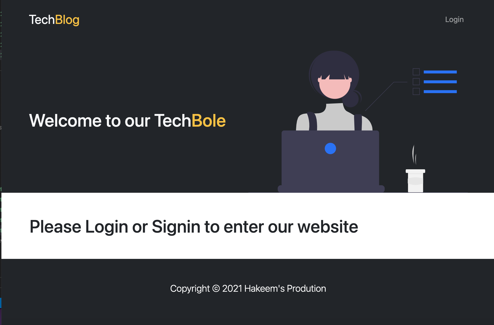
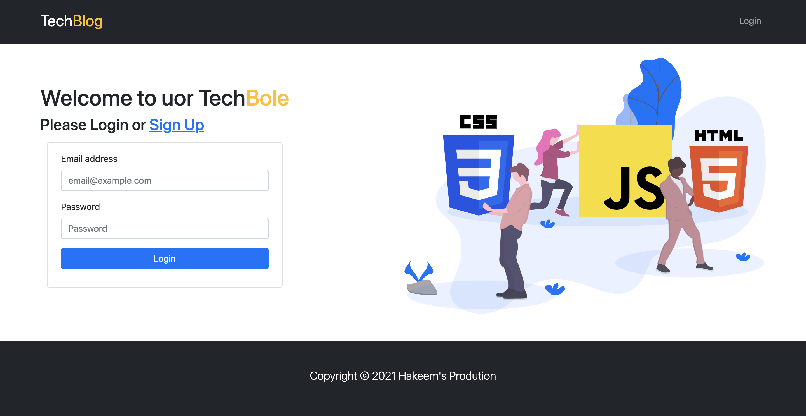
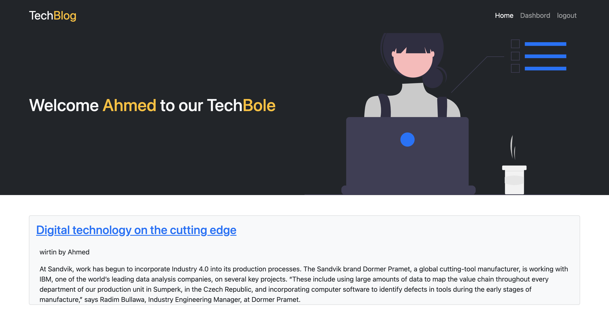
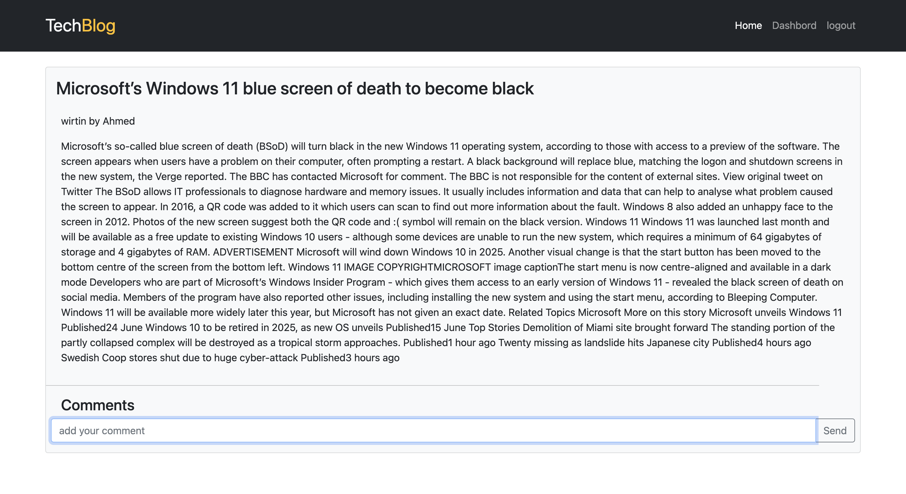
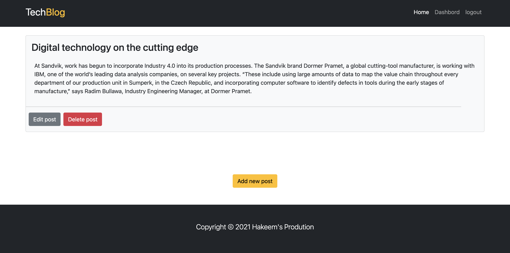
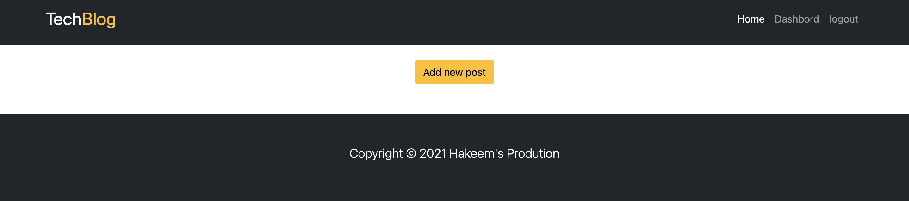
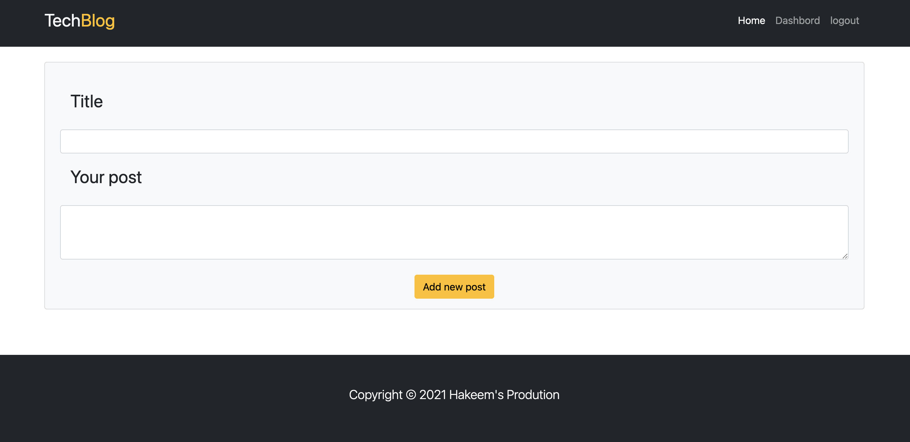

# Tech-Blog

## Table of contents
 * [General info](#General-Info)
 * [Specifics](#Specifics)
 * [Deployment of application](#Deployment-of-application)
 * [Application Code](#Application-Code)
 * [Screenshots](#Screenshots)
 * [Future Developments](#Future-Developments)

 # General Info
   Tech-Blog is an application that allows users to read, create, edit and delete posts, as well create comments under any existing post.

 # Specifics

   * Entering the application:
     * In order to proceed with application user has to login or register. 
      
 
   * Homepage:
     * Once user is successfully logedin, the option to logout will be shown in navigation bar
     * User is presenting with randomly selected 3 posts
     * There is an option on the bottom “View all post”
     * All posts contain title, content, username, who created it, and the date when the post was created
     * User can add comment or view all comments for each post
     * By clicking on the one post user will be presented with current post only, where “add comment” and all comments for the post will be available 

   * Dashboard:
     * User can view their own posts, if they exist. If user did not create any, an option “Create new post” will be presented
     * If user already has posts, option to “Edit” or “Delete” will be presented
     * All user’s posts arrange based on the date they were created (from the most recent) 

   * Create a New Post
     * User can create a post by clicking on “New Post” on navigation bar or while browsing the dashboard with no posts created
     * User has to write a title and a content in order to create the post
     * After submitting user will be relocated to dashboard, where “edit”, or “delete” the post options will be presented
     * All created posts will contain username and the date

   * Log Out
     * After user click on the logout button, entering page will be presented
     * User will be automatically signed out when idle on the page for more than 5 mins

 # Deployment of application

   To run a project, please follow the link 

   [Heroku](https://hakeemstechblog.herokuapp.com/)

 # Application Code

   To view application code, please follow the link 

   [GitHub](https://github.com/hakeem235/TechBlog)

 # Screenshots

   

   ### Sign in page
   

  
   ### Home page with 1 post
   

   ### Single page
   

   ### Dashboard page when user has posts
   

   ### Dashboard page for new user, with no posts
   

   ### Create a post page
   

